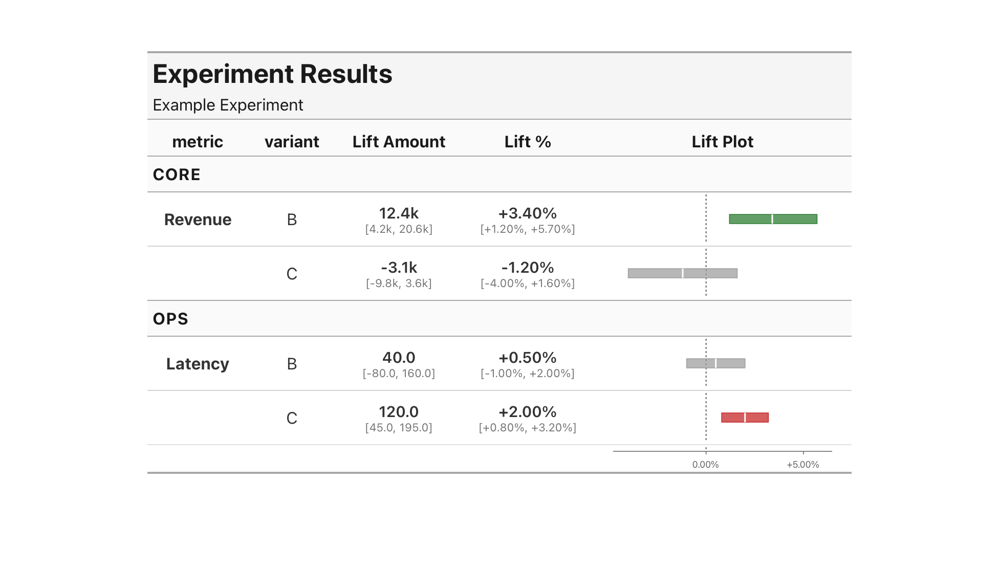
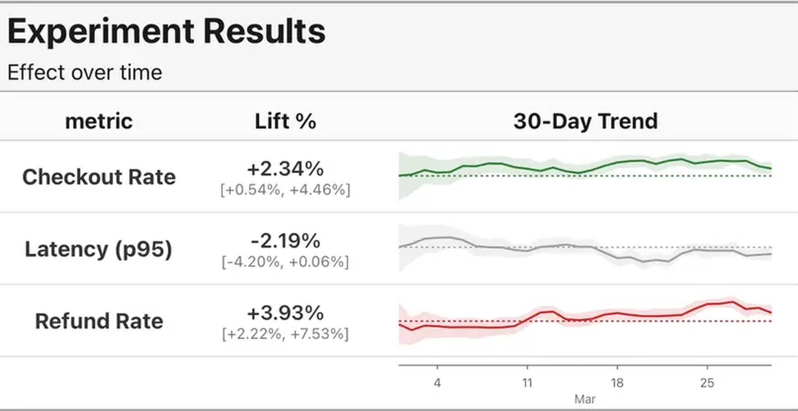

# coeftable

Lightweight, report-ready summary tables for estimates with uncertainty. Renders
inline forest plots, builds on great_tables HTML output, and works with pandas,
polars, or pyarrow frames.



## Installation

```bash
uv add coeftable
```

## Quick start

The one-line form declares a table with a single estimate column:

```python
import polars as pl
import coeftable as ct

df = pl.DataFrame(
    {
        "metric": ["Revenue", "Latency"],
        "est": [3.4, 0.5],
        "lb": [1.2, -1.0],
        "ub": [5.7, 2.0],
    }
)

ct.CoefTable(df, rows="metric", estimate="est", ci=("lb", "ub"))
```

A `CoefTable` renders itself in marimo, Jupyter, and any other `_repr_html_`-aware viewer —
leave it as the last expression in a cell, no extra call needed. Outside a notebook,
`table.as_raw_html()` is the HTML string entry point. `.gt()` remains the escape hatch to the
underlying [great_tables](https://posit-dev.github.io/great-tables/) object itself:
`table.gt().save("t.png")` for an image, `table.gt().tab_options(...)` to keep styling with
great_tables' own API.

## Data shape

coeftable expects a dataframe where every row is a single comparison. The
resolution logic maps pairs of upper / lower bound columns to each estimate, so
your data should be **wide in triples** — one point-estimate column and (when
applicable) its lower and upper bound columns — rather than in long format with
a `parameter` column.

**Dimensions:**
- `rows` — the label for each row in the table (e.g. a metric name).
- `nest` — an optional secondary label stacked below each row.
- `groups` — an optional column whose values produce section headers. A row
  label may appear under more than one group, in which case it renders once per
  section — so the same set of metrics can be reported per region without
  inventing a `nest` column to tell them apart. Pass
  `collapsible_groups=True` to make those sections collapsible in the rendered
  HTML — a pure CSS toggle (relies on `:has()`, Baseline since late 2023; on an
  older browser without it the toggle no-ops and sections stay expanded), no
  JavaScript, sections start expanded. Applies to `as_raw_html()`/`_repr_html_`;
  `.gt()` is unaffected.
- `split_columns` — an optional column whose values produce repeated column
  groups side by side, useful for comparing methods.

**Series columns bend this rule.** A point estimate is one number (plus
bounds), so a triple of scalar columns holds it. A `.sparkline(...)` series
is N points, not one -- most naturally via the companion-frame door, a
separate long frame with one row per point, joined by the table's row/nest/
split keys. Or, when the series is already collapsed onto its row, its
`value` / `ci` columns can instead hold a *list* per row directly. Either
way a row of the table is still one row; the series column just carries
more data per row than an estimate column does. See
[Trend over time](#trend-over-time) for both shapes.

## Experiment table

Build a complete experiment results table with multiple estimates, a forest
plot column, grouped row sections, nested variants, and direction hints:

```python
import polars as pl
import coeftable as ct

experiment = pl.DataFrame(
    {
        "area": ["Core", "Core", "Ops", "Ops"],
        "metric": ["Revenue", "Revenue", "Latency", "Latency"],
        "variant": ["B", "C", "B", "C"],
        "att": [12400.0, -3100.0, 40.0, 120.0],
        "att_lb": [4200.0, -9800.0, -80.0, 45.0],
        "att_ub": [20600.0, 3600.0, 160.0, 195.0],
        "rel": [3.4, -1.2, 0.5, 2.0],
        "rel_lb": [1.2, -4.0, -1.0, 0.8],
        "rel_ub": [5.7, 1.6, 2.0, 3.2],
    }
)

(
    ct.CoefTable(experiment, rows="metric", nest="variant", groups="area")
    .estimate("Lift Amount", "att", ci=("att_lb", "att_ub"), fmt=ct.Number(compact=True))
    .estimate("Lift %", "rel", ci=("rel_lb", "rel_ub"), fmt=ct.Percent(signed=True))
    .forest("Lift Plot", of="Lift %", ref=0.0, symmetric=True)
    .header("Experiment Results", "Example Experiment")
    .with_direction({"Latency": "lower_is_better"})
)
```

## Comparing methods

Use `split_columns` to compare multiple methods side by side. Each value in the
split column produces its own set of estimate / forest columns:

```python
import polars as pl
import coeftable as ct

methods = pl.DataFrame(
    {
        "metric": ["Revenue", "Revenue", "Latency", "Latency"],
        "method": ["A", "B", "A", "B"],
        "est": [3.4, 3.1, 0.5, 0.6],
        "lb": [1.2, 1.0, -1.0, -0.8],
        "ub": [5.7, 5.2, 2.0, 2.1],
    }
)

(
    ct.CoefTable(
        methods, rows="metric", split_columns="method", estimate="est", ci=("lb", "ub")
    ).header("Cohort Revenue by Method")
)
```

## Repeating metrics across sections

A row label may appear under more than one `groups` value. The same metrics can
therefore be reported per region, each section repeating the full set:

```python
import polars as pl
import coeftable as ct

regions = pl.DataFrame(
    {
        "metric": ["Revenue", "Signups", "Revenue", "Signups"],
        "region": ["US", "US", "EU", "EU"],
        "est": [1.2, 0.4, 2.1, 0.9],
        "lb": [0.8, 0.1, 1.5, 0.5],
        "ub": [1.6, 0.7, 2.7, 1.3],
    }
)

(
    ct.CoefTable(
        regions, rows="metric", groups="region", collapsible_groups=True
    )
    .estimate("Effect", "est", ci=("lb", "ub"))
    .forest("Effect Plot", of="Effect", ref=0.0, symmetric=True)
)
```

## Theming

Four built-in themes are available from `coeftable.theme`:

```python
from coeftable.theme import BLUE, COLORBLIND, DEFAULT, MONO, TEXTUAL

DEFAULT  # Alias for TEXTUAL -- what CoefTable uses if you don't set a theme
TEXTUAL  # Minimal, publication-style: muted colours, light chrome
BLUE  # The original blue-grey palette
COLORBLIND  # Colourblind-safe palette
MONO  # Grayscale for mono journals
```

Apply one with `.with_theme(...)`:

```python
table.with_theme(BLUE)
```

Customise a theme with `dataclasses.replace`:

```python
from dataclasses import replace

my_theme = replace(BLUE, favorable="#0072B2")
```

Use `with_direction` to mark rows where lower values are favourable (reusing
the `df` frame from [Quick start](#quick-start)):

```python
table = ct.CoefTable(df, rows="metric", estimate="est", ci=("lb", "ub")).with_direction(
    {"Latency": "lower_is_better"}
)
```

## Trend over time



Add a `.sparkline(...)` column to plot a metric's trajectory next to its
point estimate: an inline SVG line with a shaded credible interval and a
dashed reference line (pass `show_endpoint=True` to also label the last
value). Below, `ref=0.0` draws the reference line that Latency's series
crosses as its credible interval narrows over three weeks of data:

There are two front doors for the series data, the same list-columns vs.
companion-frame choice used elsewhere in coeftable:

**A long companion frame** — the shape most real series data already
arrives in: a SQL export, a dbt model, an experimentation platform's daily
metrics table. Pass `data=` a separate frame with one row per point, and
`value` / `ci` / `x` name *scalar* columns on it. coeftable groups the
companion frame by the table's `rows` (+ `nest`, + `groups`, +
`split_columns`) keys and collapses each group into a series internally.
`groups` participates only when `data` actually carries that column, so a
companion frame keyed on the row alone stays valid. The one case that needs
it is a row label appearing under more than one group: without the group
column in `data` those rows are indistinguishable, so coeftable reports it
rather than serving every section the same merged series.

```python
import datetime as dt
import pandas as pd
import polars as pl
import coeftable as ct

dates = [dt.date(2024, 1, 1), dt.date(2024, 1, 8), dt.date(2024, 1, 15)]

trend = pl.DataFrame(
    {
        "metric": ["Revenue", "Latency"],
        "lift": [3.4, 0.5],
        "lift_lb": [1.2, -1.0],
        "lift_ub": [5.7, 2.0],
    }
)

history = pd.DataFrame(
    {
        "metric": ["Revenue", "Revenue", "Revenue", "Latency", "Latency", "Latency"],
        "date": dates + dates,
        "lift": [1.5, 2.4, 3.4, -1.0, 0.2, 1.5],
        "lift_lb": [0.3, 1.4, 2.6, -2.5, -0.6, 1.0],
        "lift_ub": [2.7, 3.4, 4.2, 0.5, 1.0, 2.0],
    }
)

(
    ct.CoefTable(trend, rows="metric")
    .estimate("Lift %", "lift", ci=("lift_lb", "lift_ub"), fmt=ct.Percent(signed=True))
    .sparkline(
        "Trend",
        value="lift",
        ci=("lift_lb", "lift_ub"),
        x="date",
        data=history,
        ref=0.0,
        axis_fmt=ct.DateAxis(),
    )
)
```

**List columns on the main frame** — if the series is already collapsed
onto its row (e.g. from a prior `.group_by(...).agg(...)`, or a source that
natively stores arrays), `value` / `ci` / `x` can instead name columns
whose cells each hold one list of points per row:

```python
import datetime as dt
import polars as pl
import coeftable as ct

dates = [dt.date(2024, 1, 1), dt.date(2024, 1, 8), dt.date(2024, 1, 15)]

trend = pl.DataFrame(
    {
        "metric": ["Revenue", "Latency"],
        "lift": [3.4, 0.5],
        "lift_lb": [1.2, -1.0],
        "lift_ub": [5.7, 2.0],
        "history": [
            [1.5, 2.4, 3.4],
            [-1.0, 0.2, 1.5],
        ],
        "history_lb": [
            [0.3, 1.4, 2.6],
            [-2.5, -0.6, 1.0],
        ],
        "history_ub": [
            [2.7, 3.4, 4.2],
            [0.5, 1.0, 2.0],
        ],
        "date": [dates, dates],
    }
)

(
    ct.CoefTable(trend, rows="metric")
    .estimate("Lift %", "lift", ci=("lift_lb", "lift_ub"), fmt=ct.Percent(signed=True))
    .sparkline(
        "Trend",
        value="history",
        ci=("history_lb", "history_ub"),
        x="date",
        ref=0.0,
        axis_fmt=ct.DateAxis(),
    )
)
```

Both render the same column. Reach for the companion frame first — it
matches how most series data actually arrives, one row per observation.
Reach for list columns only when the series is already collapsed onto its
row.

Since `x` is always shared table-wide (dates must line up across rows), a
series with fewer points than its neighbours visibly occupies only part of
its cell's width rather than stretching to fill it — this is intentional,
not a bug: `x` position reflects where a point falls in the shared domain,
never the row's own extent.

Want a plain trend line with no uncertainty band — no `ci`, no ribbon?
great_tables' own `.gt().fmt_nanoplot(...)` covers that directly.
`.sparkline(...)` exists specifically for the estimate-with-interval case.

**Shaping the y-axis.** Each row's domain fits tightly to its own data by
default (`scale="row"`, `autoscale="tight"`). Four ways to change that,
shown together against the same noisy series:

```python
import polars as pl
import coeftable as ct

trend = pl.DataFrame(
    {
        "metric": ["Revenue"],
        "lift": [[1.0, 1.05, 0.95, 1.02, 0.98, 300.0]],
    }
)

(
    ct.CoefTable(trend, rows="metric")
    # Default: fits tightly to this row's own min/max. A single outlier
    # like the 300.0 here dominates and flattens the rest of the series.
    .sparkline("Tight (default)", value="lift", ref=1.0)
    # autoscale="robust" fits an IQR/Tukey fence instead of raw min/max,
    # so the outlier doesn't flatten the rest. It still draws -- clipped
    # to the domain edge and flagged with a clip-cap marker, never hidden.
    .sparkline("Robust", value="lift", ref=1.0, autoscale="robust")
    # max_ylim=N narrows whatever domain scale/autoscale would have
    # produced -- clamping to `ref +/- N`, only if the natural domain
    # would have exceeded that ceiling. Composes with autoscale.
    .sparkline("Ceiling", value="lift", ref=1.0, max_ylim=0.5)
    # ylim=(lo, hi) is an absolute override, replacing scale/autoscale/
    # max_ylim entirely.
    .sparkline("Override", value="lift", ref=1.0, ylim=(0.9, 1.1))
)
```

**Forest plots take `autoscale` too.** A single extreme interval (say a
+3000% lift among sub-1% metrics) otherwise stretches the shared domain
and flattens every other bar:

```python
lifts = pl.DataFrame(
    {
        "metric": ["Checkout CVR", "Signup Rate", "Retention D7", "AOV", "Rare Event"],
        "rel": [0.03, -0.05, 0.08, 0.02, 30.0],
        "rel_lb": [0.01, -0.09, 0.04, -0.01, 22.0],
        "rel_ub": [0.05, -0.01, 0.12, 0.05, 41.0],
    }
)

(
    ct.CoefTable(lifts, rows="metric")
    .estimate("Lift %", "rel", ci=("rel_lb", "rel_ub"), fmt=ct.Percent(signed=True))
    # "robust" fits an IQR/Tukey fence over the pooled values instead of
    # the raw min/max, so the outlier stops dictating the axis. Composes
    # with symmetric= (fence first, then mirror around ref); ylim= still
    # overrides everything.
    .forest("Lift Plot", of="Lift %", ref=0.0, autoscale="robust")
)
```

A discounted interval is never hidden: bars in a clipping domain plot
against a slightly inset region and the clipped interval continues into
the reserved margin as a gradient fade, reading as "extends beyond the
axis". Buckets with nothing clipped render exactly as before.

**No reference, or a hidden one.** `ref` also drives the dashed line and
colour resolution; two ways to opt out, for data with no meaningful
zero (revenue, durations, absolute counts):

```python
absolute = pl.DataFrame(
    {
        "metric": ["Revenue", "Latency"],
        "value": [[282.3, 300.1, 320.0], [900.0, 910.0, 920.0]],
    }
)

(
    ct.CoefTable(absolute, rows="metric")
    # ref=None: no reference at all. No dashed line, no forced domain
    # inclusion of 0, and every cell colours neutral -- "favorable" has
    # no meaning without something to compare against.
    .sparkline("No reference", value="value", ref=None)
    # ref=0.0, show_ref=False: the reference is real and still drives
    # colour (favorable/unfavorable against 0), it just isn't drawn or
    # forced into the domain. Opt in deliberately: a mark can then claim
    # "above the reference" while the reference sits off-canvas.
    .sparkline("Hidden reference", value="value", ref=0.0, show_ref=False)
)
```

## Standalone plots

The inline SVG plots that power `.forest(...)` and `.sparkline(...)` columns
are available directly from `coeftable.plots` — the same emitters, the same
themes, no table required. Each function returns a complete `<svg>` string
for embedding anywhere HTML goes:

```python
from coeftable.plots import forest_bar, sparkline_bar
from coeftable.theme import DEFAULT
import coeftable as ct

bar = forest_bar(
    1.2, 0.4, 2.0,            # estimate, lower, upper
    domain=(-1.0, 3.0),
    ref=0.0,
    color=DEFAULT.favorable,
    theme=DEFAULT,
)

line = sparkline_bar(
    [0.0, 1.0, 2.0],          # x
    [1.0, 1.5, 2.0],          # y
    [0.5, 1.0, 1.6],          # lower
    [1.5, 2.0, 2.4],          # upper
    x_domain=(0.0, 2.0),
    domain=(0.0, 3.0),
    ref=0.0,
    color=DEFAULT.favorable,
    fmt=ct.Number(),
    theme=DEFAULT,
)
```

Also exported: `sparkline_multi` + `Trace` for overlaid series,
`forest_axis` / `sparkline_axis` for the shared axis footer under a column
of plots, and `ResolvedRule` / `ResolvedBand` for reference lines and
shaded intervals via each function's `annotations=` parameter. Because a
standalone plot and a table column share one `Theme`, a report that mixes
both stays visually consistent.

## Metric cards (experimental)

`coeftable.cards` composes the standalone plots into measured, foldable
metric cards — the same formatters, themes, and SVG primitives as the
tables. The API is experimental and may change; it is deliberately not
exported from the top-level `coeftable` namespace yet.

```python
import coeftable as ct
from coeftable.cards import Card, CardGrid
from coeftable.cards.regions import Diagnostics, Event, Events, Metric, Trend

events = Events([Event("launch", "#4C72B0", at=2.0)])
revenue = Card(
    "Revenue",
    subtitle="weekly lift vs control",
    content=[
        Metric(3.4, ct.Percent(signed=True), ci=(1.2, 5.7), ref=0.0),
        Trend(
            x=(0, 1, 2, 3), y=(0.3, 0.8, 1.1, 1.5),
            lower=(-0.1, 0.3, 0.6, 0.9), upper=(0.7, 1.3, 1.6, 2.1),
            x_domain=(0, 3), domain=(-0.5, 2.5), ref=0.0,
            annotations=events.rules(),
        ),
        Diagnostics("diagnostics", [("n", 412), ("sigma", 0.8)]),
        events,
    ],
)
grid = CardGrid([revenue, revenue.with_theme(ct.theme.BLUE)])
```

A `Card` (or `CardGrid`) left as the last notebook expression renders
itself; `as_raw_html()` is the string entry point. Cards are fixed-width
with exact measured heights and fold via a native `<details>` header (the
headline value stays visible as a chip when it fits beside the header,
and is omitted otherwise). A standalone card collapses to
its header; inside a `CardGrid` each card's expanded footprint stays
reserved, so folding never reflows neighbors.

## Metric panels (experimental)

`coeftable.cards` panels put named side-by-side panes in one bordered shell
with a shared header and footer: the compositional step above cards. The API
is experimental and may change; it is deliberately not exported from the
top-level `coeftable` namespace yet.

```python
import coeftable as ct
from coeftable.cards import Metric, Pane, Panel, Row, TextBlock

summary = Pane(
    "Summary",
    content=(
        TextBlock("Weekly revenue", variant="subtitle"),
        Metric(3.4, ct.Percent(signed=True), ci=(1.2, 5.7), ref=0.0),
    ),
    width=220,
)
segments = Pane(
    "Segments",
    content=(
        Row(
            (
                (TextBlock("Enterprise"), 85),
                (Metric(8.1, ct.Percent(signed=True)), 105),
            )
        ),
    ),
    width=200,
)
header = Row(
    (
        (TextBlock("Revenue", variant="title"), 320),
        (Metric(3.4, ct.Percent(signed=True)), 120),
    ),
    gap=16,
)
panel = Panel((summary, segments), header=(header,))
html = panel.as_raw_html()
```

Panes declare usable content widths; cell widths are author inputs; the panel
derives its own footprint with exact measurement, not responsive guessing.

A `Panel` left as the last notebook expression renders itself via
`_repr_html_`; `with_theme()` returns the same composition under another
theme.

## Metric trees (experimental)

`coeftable.graph` turns metric cards wired into a driver DAG into a metric
tree: the graph layer adds slotted layout, vertical wires, and zero-JS
fold/downstream-hide behavior. The API is experimental and may change; it is
deliberately not exported from the top-level `coeftable` namespace yet.

```python
import coeftable as ct
from coeftable.cards import Card
from coeftable.graph import MetricTree

tree = MetricTree(
    nodes=(
        ("revenue", Card("Revenue")),
        ("price", Card("Price")),
        ("volume", Card("Volume")),
        ("retention", Card("Retention")),
    ),
    edges=(
        ("revenue", "price", 1.2),
        ("revenue", "volume", 2.1),
        ("volume", "retention", -0.6),
    ),
    fmt=ct.Number(suffix=' pp', decimals=1, signed=True, thousands=False),
    dom_prefix='drivers',
)
html = tree.as_raw_html()
```

Use a distinct `dom_prefix` for each tree when rendering multiple graphs in one
document, so their generated control, card, and wire ids remain disjoint.

Each card retains its native `<details>` fold control. The nub under a parent
hides a node only when every root path to it is blocked: collapsing one parent
of a shared child leaves that child visible via the other path, all with pure
CSS and no JavaScript.

A `MetricTree` left as the last notebook expression renders itself via
`_repr_html_`; `with_theme()` follows the same conventions as cards.

## Driver-tree reports (experimental)

`coeftable.graph.DriverTree` is the composition root over the metric-tree
layer: give it level series and a decomposition per parent, and it builds the
cards, wires, and layout itself, plus three opt-in honesty checks a hand-built
`MetricTree` graph would otherwise have to redo per node. The API is
experimental and may change; it is deliberately not exported from the
top-level `coeftable` namespace yet.

```python
import coeftable as ct
from coeftable.graph import DriverTree
from coeftable.graph.breakout import Breakout
from coeftable.graph.timeline import TimelineEvent

x = (0.0, 1.0, 2.0, 3.0)
series = {
    "revenue": (1000.0, 1071.0, 1144.0, 1219.0),
    "users": (100.0, 105.0, 110.0, 115.0),
    "aov": (10.0, 10.2, 10.4, 10.6),
    "us": (600.0, 640.0, 680.0, 720.0),
    "eu": (400.0, 431.0, 464.0, 499.0),
}
titles = {"revenue": "Revenue", "users": "Users", "aov": "AOV", "us": "US", "eu": "EU"}
breakouts = {
    "revenue": (
        Breakout(key="drivers", label="by drivers", op="x", children=("users", "aov")),
        Breakout(key="region", label="by region", op="+", children=("us", "eu")),
    )
}
events = (TimelineEvent(at=1.0, label="Launch", color="#4C72B0", affects=("revenue", "users")),)

report = DriverTree(
    series,
    titles,
    breakouts,
    ct.Percent(decimals=1),
    x,
    events=events,
    level_fmt=ct.Number(decimals=1),
)
html = report.as_raw_html()
```

Every node id in `series` and `titles` is derived from `breakouts`: each key
is a parent, and each `Breakout` names one decomposition of it (an `op="x"`
product or an `op="+"` sum) plus the child node ids it contributes. A parent
with two or more breakouts (like `revenue` above) renders a native
`<select>` that swaps its children's whole subtree in place — no JavaScript,
because the alternatives share one slotted position and pure CSS shows
exactly one of them at a time.

Each decomposition is checked against its own arithmetic: a parent that
should equal the sum or product of its children but falls short gets an
injected `"Unattributed"` residual card (additive shortfalls) or a reported
gap badge (multiplicative shortfalls, which have no subtraction fix), and a
decomposition explaining under 80% of its parent refuses to build rather than
render a misleading tree. Every wire's label role comes from its own child's
noise-aware confidence interval, so a wobbly delta renders muted with a
`· ns` marker instead of a confident color. Anti-correlated siblings (movers
that trade off against each other week to week) surface a callout on their
parent card, and the root card carries a fixed disclaimer that edge labels
are accounting, not causal claims. `events` fan out to every card named in
their `affects` tuple, both as sparkline markers and as captions, and the
report's header is a timeline strip indexing them across the whole canvas.

**Switchers can nest.** Every level of the tree may carry its own switcher at
the same time — revenue by drivers or region, and within drivers, active users
by funnel or country, and within that, sessions by platform or channel.
Switching an outer choice takes away the whole branch beneath it, including any
nested switcher and its alternatives; switching back restores it with the inner
selection intact, because a native `<select>` keeps its value while hidden.

**Limitations.** All alternatives of one switcher must have the same number of
children, since they share the same positions.

And every card must have a parent under every combination of choices. Nesting
satisfies this on its own: an outer choice that removes a whole branch is decided
by the outer rule alone, and the cards below it go with it. What is refused is a
card that would be left *stranded* — one whose routes into the tree run through
two different switchers such that some pair of selections closes all of them.

The concrete case is a card reachable both through a nested branch and through a
different alternative of the switcher above it. Keep the outer branch that
preserves the nested switcher, then choose an inner option that does not reach
that card, and both of its routes are gone at once. Since each switcher's rules
are emitted independently, neither one alone can see that. Such a tree is
rejected at construction with a `SpecError` naming the card and both switchers.

`DriverTree` returns a `GraphReport`: the underlying `Graph` plus a
measured, exact-width timeline strip stacked above it. `report.measure()`,
`report.as_raw_html()`, and its `_repr_html_` notebook display all work the
same way they do for a plain `Graph`.

## Plot annotations

`ct.Rule` draws a line and `ct.Band` shades an interval in a forest plot or
sparkline. A numeric, date, or datetime coordinate is a literal; a string is
the name of a scalar column on the main table frame. A missing field value
leaves that annotation out of that row, which makes row-specific marks
possible:

```python
import polars as pl
import coeftable as ct

annotated = pl.DataFrame(
    {
        "metric": ["Revenue", "Latency"],
        "estimate": [1.2, -0.4],
        "lower": [0.8, -0.8],
        "upper": [1.6, 0.1],
        # Only Revenue receives the second vertical rule.
        "target": [1.5, None],
        "trend": [[1.0, 1.2, 1.4], [-0.1, -0.3, -0.4]],
        "guard_low": [0.9, -0.6],
        "guard_high": [1.6, 0.0],
    }
)

(
    ct.CoefTable(annotated, rows="metric")
    .estimate("Effect", "estimate", ci=("lower", "upper"))
    .forest(
        "Effect plot",
        of="Effect",
        annotations=(ct.Rule("target", axis="x"),),
    )
    .sparkline(
        "Trend",
        value="trend",
        annotations=(ct.Band("guard_low", "guard_high", axis="y"),),
    )
)
```

Forest annotations use `axis="x"` only. Sparklines accept `axis="x"` and
`axis="y"`; use the former for a shared time or sequence position and the
latter for a value threshold or range. `layer="underlay"` (the default for
bands) draws before the plot; `layer="overlay"` (the default for rules) draws
after it. `affect_domain=True` by default expands an automatic axis domain to
include the annotation; set it to `False` to keep the existing domain and
allow the mark to be clipped. `ylim` overrides the Forest x-domain and the
Sparkline y-domain, so annotations on those axes do not expand them. Sparkline
x annotations still participate in their shared x-domain; `max_ylim` can cap
the Sparkline y-domain and clip or omit distant marks. Annotations supplement
rather than replace
`ref`: `ref` remains the built-in semantic reference that controls colors and
its optional dashed line.
