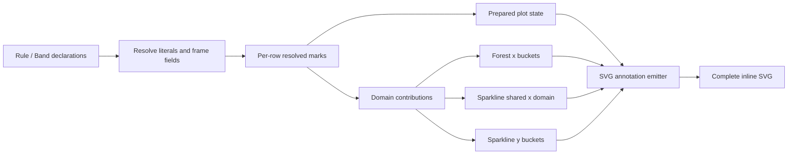

# Extensible Plot Annotations

**Status:** Approved design
**Date:** 2026-08-14

## Problem

`Forest` and `Sparkline` each render a single built-in reference rule. Callers cannot add a second threshold to one row without replacing the complete plot cell with custom SVG. That workaround duplicates projection, scaling, clipping, and theme behavior.

The feature needs a small typed interface for composing annotations with existing plots. The first implementation must support both plot kinds and more than one mark family without becoming a general chart grammar or exposing raw SVG callbacks.

## Goals

- Add typed axis-aligned `Rule` and `Band` annotations to forest plots and sparklines.
- Bind annotation coordinates from literals or scalar columns in the main table frame.
- Let missing field values omit an annotation from a specific row.
- Preserve existing domain sharing, explicit-limit precedence, rendering, and reference semantics.
- Give callers two stable draw positions: under the existing plot or over it.
- Concentrate source resolution, validation, domain contribution, projection, clipping, and SVG escaping behind small interfaces.
- Keep the model extensible to future typed marks without committing to arbitrary callbacks or a full plotting grammar.

## Non-goals

- Text labels, point annotations, arrows, free-form paths, or arbitrary SVG.
- Row-label selectors or predicate callbacks.
- Annotation data from a sparkline companion frame.
- Numeric z-index ordering.
- Interactive marks, legends for annotations, or collision avoidance.
- Making annotations render a plot in a cell whose base estimate or series is absent.
- Replacing `ref`, `show_ref`, semantic role resolution, or existing axis footers.

## Public interface

Both plot builders accept the same `annotations` parameter:

```python
import datetime as dt
import coeftable as ct

(
    ct.CoefTable(frame, rows="metric")
    .estimate("Effect", "estimate", ci=("lower", "upper"))
    .forest(
        "Plot",
        of="Effect",
        annotations=(
            # `row_target` is populated only for the row that needs this rule.
            ct.Rule(at="row_target", axis="x"),
            ct.Band(start=-0.2, end=0.2, axis="x", layer="underlay"),
        ),
    )
    .sparkline(
        "Trend",
        value="lift",
        annotations=(
            ct.Rule(at=dt.date(2026, 8, 1), axis="x"),
            ct.Band(start="guardrail_low", end="guardrail_high", axis="y"),
        ),
    )
)
```

Conceptual signatures:

```python
@dataclass(frozen=True)
class Rule:
    at: int | float | date | datetime | str
    axis: Literal["x", "y"]
    layer: Literal["underlay", "overlay"] = "overlay"
    affect_domain: bool = True
    color: str | None = None
    opacity: float = 1.0
    width: float = 1.0
    dash: Literal["solid", "dashed", "dotted"] = "dashed"

@dataclass(frozen=True)
class Band:
    start: int | float | date | datetime | str
    end: int | float | date | datetime | str
    axis: Literal["x", "y"]
    layer: Literal["underlay", "overlay"] = "underlay"
    affect_domain: bool = True
    color: str | None = None
    opacity: float = 0.12
```

`Forest.annotations` and `Sparkline.annotations` are immutable tuples internally. Builder methods accept any finite sequence and snapshot it to a tuple.

### Source interpretation

- Numeric, `date`, and `datetime` values are literals.
- A string names a scalar column in the main `CoefTable` frame.
- Literal string coordinates are unsupported because current plot axes are numeric or temporal, not categorical.
- A missing rule value omits that rule for the cell.
- A band is omitted when either endpoint is missing.
- Field-bound annotations follow the existing cell identity, including row, nest, group, and split values. No separate selector language is needed.
- Companion-frame sparklines still read annotation fields from the main table frame. This keeps one unambiguous row-level source.
- Multi-series sparklines resolve and draw each annotation once per cell, not once per arm.

### Axis support

- Forest plots support `axis="x"` only. It produces a vertical rule or band on the estimate domain.
- Sparklines support `axis="x"` and `axis="y"`.
  - `x` uses the shared numeric or temporal series domain.
  - `y` uses the existing scale bucket selected by `scale`.
- Unsupported axes fail during specification validation, before rendering.

### Styling and order

- `color=None` uses `theme.axis`; callers may override it per mark.
- Dash values are typed choices rather than raw SVG strings.
- Rules default to `overlay`; bands default to `underlay`.
- All underlays render before existing plot content. All overlays render after it.
- Declaration order is preserved within each layer.
- Bands clip to the plot rectangle. Rules outside a resolved domain are omitted.
- An annotation that does not affect the domain can therefore be partially clipped or entirely absent.

## Reference compatibility

`ref` remains separate from public annotations because it has semantic responsibilities annotations do not:

- It drives favorable, unfavorable, and inconclusive role resolution.
- It participates in automatic domains under the existing rules.
- Sparkline `show_ref=False` retains the reference for color while excluding it from drawing and domain calculation.
- Its color and insertion point remain unchanged.

The renderer may translate `ref` into the same private resolved-rule representation used by annotations, but it inserts that rule at the current reference position. Public underlay/overlay choices do not expose or alter this internal position.

A custom rule never affects semantic color roles. Coincident custom and reference rules are allowed and draw independently.

## Module design

### `coeftable.annotations`

A new module owns:

- Public immutable `Rule` and `Band` declarations.
- Public annotation type aliases.
- Declaration-level validation.
- Resolution of literal and field sources into private numeric/temporal marks.
- Private resolved mark values used by domain and SVG modules.
- Domain-contribution helpers.

This is the seam between declarative table specifications and plot geometry. Callers learn two mark types; they do not learn frame indexing, temporal normalization, projection, clipping, SVG structure, or plot-specific domain buckets.

### `coeftable.spec`

`Forest` and `Sparkline` gain `annotations` fields and builder arguments. Their existing `prepare` methods:

1. Resolve declarations once against the main frame.
2. Associate resolved marks with existing source-row indexes.
3. Add eligible coordinates to automatic domain inputs.
4. Store per-row resolved marks in prepared column state.

Their `cell` methods pass only resolved marks to SVG emitters. They never re-read annotation columns or repeatedly coerce values.

`ColumnKind.sources()` includes annotation field names, so the existing required-column scan validates and selects them with other inputs.

### `coeftable.svg`

A private annotation emitter accepts:

- Resolved marks for one cell.
- Available x/y projectors.
- Plot bounds.
- Requested layer.
- Theme defaults.

It emits escaped SVG fragments, not complete plots. Forest and sparkline renderers call it around their existing content:

```text
underlay annotations
existing plot content, including the built-in reference
overlay annotations
```

Projection stays inside `svg.py`, alongside `_projector`; callers and specification classes do not handle pixels.

## Preparation and data flow



Resolution is $O(R \times A)$ for $R$ source rows and $A$ declared annotations. Prepared marks are retained once and reused by cell rendering. Rendering allocates only the SVG fragments required for the current cell.

## Domain semantics

`affect_domain=True` participates in automatic domain calculation, but explicit
domain constraints remain authoritative.

- A rule contributes its position.
- A band contributes both endpoints.
- Forest contributions enter the existing domain bucket selected by `scale`.
- Sparkline x contributions enter the table-wide x domain.
- Sparkline y contributions enter the existing y bucket selected by `scale`.
- Only marks belonging to cells with renderable base data contribute. An annotation does not make an otherwise blank cell establish or widen a shared domain.
- `autoscale="robust"` first filters data through its IQR/Tukey fence. Eligible annotations then join those inliers before the automatic domain is padded, so robust filtering cannot discard an annotation that requested domain participation.
- Forest `symmetric=True` expands the final automatic domain around `ref` after annotation coordinates are included.
- Sparkline `max_ylim` then applies its explicit ceiling to the y-domain and may clip a more distant annotation.
- `ylim` remains an absolute override: it overrides the Forest x-domain and Sparkline y-domain, ignoring annotation contributions on those axes. It does not override the Sparkline shared x-domain, so domain-affecting Sparkline x annotations still participate there.
- `affect_domain=False` never widens a domain. The emitter clips a partially intersecting band and omits an out-of-domain rule or band.

For temporal sparkline x axes, annotation literals and fields use the existing date/datetime-to-epoch conversion semantics. Numeric and temporal x values may not be mixed. An x annotation must match the series x kind.

## Validation and errors

Use existing exception types and failure timing:

- Missing field: `ColumnNotFoundError` through required-column validation.
- Unsupported axis, layer, dash, opacity, width, or source type: `SpecError`.
- Forest `axis="y"`: `SpecError` naming the forest column and annotation index.
- Rule width must be positive; opacity must be in `[0, 1]`.
- Present band endpoints with `start > end`: `SpecError` including the rendered row identity.
- Numeric/temporal mismatch: `SpecError` naming the annotation and expected axis kind.
- Non-finite numeric field values follow existing missing-value normalization.
- Duplicate and coincident marks are valid.

Errors must identify the plot column and annotation index. Row-dependent errors also include the row identity already available to the prepared cell path.

## Backward compatibility

- Existing `forest` and `sparkline` calls require no changes.
- `annotations=()` is behaviorally identical to the current implementation.
- Existing `ref`, `show_ref`, domain, axis, clipping, legend, and color behavior remains unchanged.
- Existing SVG ordering is unchanged when no public annotations are present.
- `Rule` and `Band` are exported from `coeftable` and covered by the public-interface contract test.

## Verification strategy

### Declaration and resolution

- Literal numeric and temporal coordinates.
- Main-frame field coordinates.
- Missing per-row values.
- Missing band endpoints.
- Invalid styles, axes, widths, opacity, and source types.
- Reversed band endpoints with useful row identity.
- Numeric/temporal x mismatch.

### SVG rendering

- Vertical and horizontal rules project to expected pixels.
- Vertical and horizontal bands project and clip correctly.
- Underlays precede existing data; overlays follow it.
- Declaration order is stable within each layer.
- Out-of-domain marks with `affect_domain=False` omit or clip as specified.
- Colors are safely escaped.
- Built-in references retain their line count, color, and insertion behavior.

### Forest integration

- A field-populated rule adds a second vertical line to exactly one row.
- Literal rules and bands appear in every non-empty cell.
- Included marks contribute under table, row-group, split-column, and row scales.
- Explicit limits override annotation contributions.
- Missing estimates remain blank.

### Sparkline integration

- Numeric x/y rules and bands.
- Temporal x rules and bands.
- Shared x-domain and keyed y-domain contribution.
- Companion-frame series with main-frame annotation fields.
- Single-series and multi-series rendering.
- Empty series remain blank.

### End-to-end

- Existing full test suite passes unchanged.
- README documents both plot types and the missing-field row-targeting pattern.
- Changelog records the new annotation interface.
- Render a real table to HTML and inspect it in Chromium:
  - one forest row contains the built-in reference plus a custom vertical rule;
  - unannotated forest rows contain only the built-in reference;
  - sparkline rules and bands align with their axis ticks;
  - underlays do not obscure data and overlays remain legible.

## Acceptance criteria

1. One shared typed interface configures annotations on both forest plots and sparklines.
2. Rules and bands support literals and main-frame fields.
3. Missing field values target marks to selected rows without selectors.
4. Forest supports x annotations; sparkline supports x and y annotations.
5. Automatic domains include annotations by default and honor per-mark opt-out.
6. Explicit domains remain authoritative.
7. Underlay/overlay ordering is deterministic.
8. Existing references retain semantic and visual behavior.
9. Invalid declarations fail before or during preparation with plot, annotation, and row context as applicable.
10. The second-vline-on-one-row scenario works end to end without custom SVG.
